# Работа с Ubuntu 20.04 Server LTS

## Содержание

## Часть 1. Установка ОС

- Скачать установочный образ ОС https://old-releases.ubuntu.com/releases/20.04/
- Скачать программу для виртуализации https://www.virtualbox.org/wiki/Downloads
- Создание виртуальной машины
- Установка ОС
- Узнать версию Ubuntu, выполнив команду `cat /etc/issue.`

Результат работы команды `cat /etc/issue`

## Часть 2. Создание пользователя

 Создать нового пользователя в группе adm

`sudo useradd -m -G adm -s /bin/bash titaniya`

`useradd`

Основная команда для создания новых пользователей в Linux

 `-m` (--create-home)

Создать домашний каталог пользователя

Без этого флага домашняя директория не создается

`-G adm` (--groups)

Добавить пользователя в дополнительные группы

`adm` — группа административного мониторинга

Пользователь будет состоять в двух группах:

Основная группа: titaniya (автоматически создается)

Дополнительная: adm

`-s /bin/bash` (--shell)

Установить командную оболочку (shell)

/bin/bash — Bourne Again SHell (стандартная оболочка)

Без этого флага используется системный shell по умолчанию (обычно /bin/sh)

Разница между `1`/bin/bash и `2`/bin/sh

Основные отличия

Характеристика:
	 
   - `1`/bin/bash (Bourne Again SHell)	`2`/bin/sh (Bourne Shell / POSIX shell)

 Тип:
 
   - `1`Расширенная, feature-rich оболочка	`2`Минималистичная, POSIX-совместимая

Размер:

  -	`1`~1.5 MB	`2`~0.5 MB (dash) или ~1 MB (bash в режиме sh)

Интерактивность:

  -	`1`Отличная (автодополнение, история)	`2`Базовая

Скрипты:

  -	`1`Расширенный синтаксис	`2`Только POSIX-совместимый синтаксис

Скорость запуска:

  -	`1`Медленнее	`2`Быстрее

По умолчанию в Ubuntu:

  -	`1`Для пользователей	`2`Для системных скриптов (/bin/sh → dash)

Команда для создания нового пользователя

Вывод cat /etc/passwd

## Часть 3. Настройка сети ОС

- Задать название машины вида user-1
  - `sudo hostnamectl set-hostname user-1`
- Установить временную зону
  - `sudo timedatectl set-timezone Europe/Moscow`
  - `timedatectl | grep "Time zone"` (проверяем временную зону)
- Вывести названия сетевых интерфейсов
  - `ip link show`
- Получить IP от DHCP и расшифровка DHCP
  - `cat /etc/netplan/*.yaml` (убеждаемся, что интерфейс использует DHCP, должно быть: dhcp4: true)
  - `ip addr show dev enp0s3 | grep "inet"` (получаем IP)

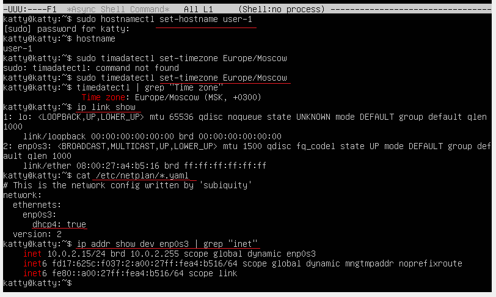

Вывод timezone, dhcp, IP
 
>lo - Loopback интерфейс (localhost) используется для сетевых подключений к самой же машине. Это виртуальный сетевой интерфейс, который не связан с физическим оборудованием (позволяет локальным программам обращаться к этому компьютеру). Обязателен для работы многих служб (например, localhost, базы данных, веб-серверы в режиме разработки).

>Dynamic Host Configuration Protocol - протокол динамической конфигурации узла, автоматически назначающий IP-адреса и другие сетевые параметры устройствам в сети(маска подсети, шлюз по умолчанию, DNS-серверы).

Определить внешний и внутренний IP шлюза
 - Внутренний IP шлюза (IP роутера в локальной сети)
  - `ip route | grep default`
 - Внешний IP шлюза (публичный IP сети в интернете)
  - `curl -s https://api.ipify.org; echo`

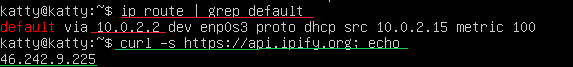

Внешний и внутренний IP

Задать статические настройки (IP, GW, DNS)

>IP-адрес	Уникальный адрес устройства в сети	

>GW (Gateway)	Шлюз по умолчанию (маршрутизатор)	

>DNS	Сервер доменных имен

- Отредактировать Netplan-конфиг 00-installer-config.yaml
  - dhcp4 ставим "no"
  - желаемый статический IP 10.0.2.200/24
  - шлюз 10.0.2.2
  - 1.1.1.1 — Cloudflare DNS, 8.8.8.8 — Google DNS.

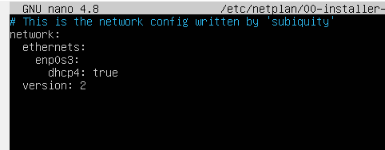

Файл до настройки

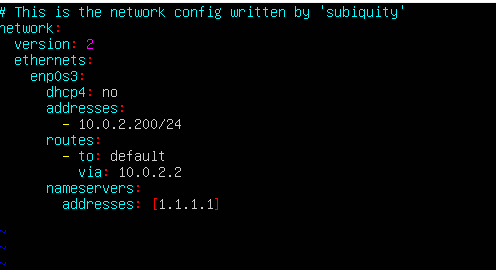

Файл после настройки

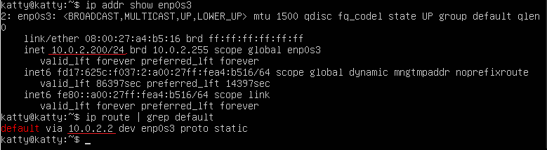

Проверка примененных настроек

- Пинг 1.1.1.1 (проверка базовой интернет-связи, диагностика проблем с DNS, тестирование качества соединения)
  - < 50 мс — отличное соединение
  - 47 packets transmitted, 47 received, 0% packet loss
    - передано пакетов 47
    - получено ответов: 47
    - потери пакетов: 0%

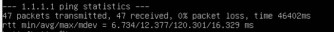

Пинг 1.1.1.1 результат

- Пинг ya.ru (компьютер преобразует ya.ru в IP-адрес.  Отправляются небольшие тестовые пакеты по протоколу ICMP (Internet Control Message Protocol), сервер ya.ru должен ответить на эти пакеты, замеряется время между отправкой и получением ответа (время отклика, RTT(Round-Trip Time))).
  - < 50 мс — отличное соединение (близкий сервер)

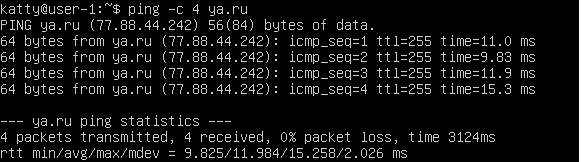

Пинг ya.ru (4 пакета)

## Часть 4. Обновление ОС

- Обновить системные пакеты до последней на момент выполнения задания версии.
     - `sudo apt update` Команда скачивает свежие метаданные о пакетах, но не устанавливает и не обновляет сами пакеты
     -  `sudo apt upgrade`  Команда обновляет установленные пакеты до последних версий

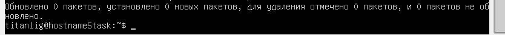

отстутствие обновлений системных пакетов

## Часть 5. Использование команды "sudo"

>Команда sudo позволяет временно повысить привилегии пользователя до уровня суперпользователя (root) для выполнения административных задач, следуя политике безопасности, определенной в файле '/etc/sudoers'

- Изменение hostname (уникальное имя компьютера в сети, которое идентифицирует устройство для людей и систем.)
  - `sudo hostnamectl set-hostname hostname5task`

Изменённый hostname

## Часть 6. Установка и настройка службы времени

 - Включить синхронизацию NTP (Network Time Protocol, протокол для синхронизации системных часов компьютеров по сети с высокой точностью (до миллисекунд))
   `sudo timedatectl set-ntp true`

- Выведи время часового пояса, в котором ты сейчас находишься.
  - `timedatectl show`

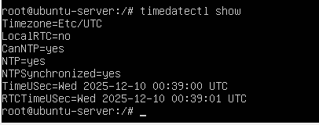

NTPSynchronized=yes

## Часть 7. Установка и использование текстовых редакторов 

- Установить текстовой редактор "vim".
      `sudo apt install vim`

- Cоздать файл *test_vim.txt*. Написать в нём свой никнейм, закрыть файл с сохранением изменений.
      `touch test_vim.txt`
      `vim test_vim.txt`

Выход с сохранением: `:wq`
Выход без сохранения: `:q!`
Поиск: `/titanlig`
Замена: `:%s/titanlig/newtext/g`

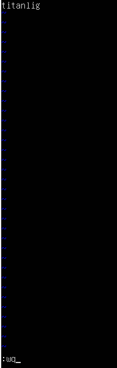

vim save

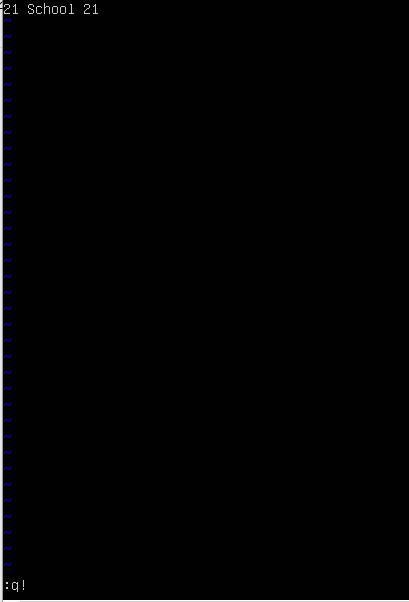

vim without save

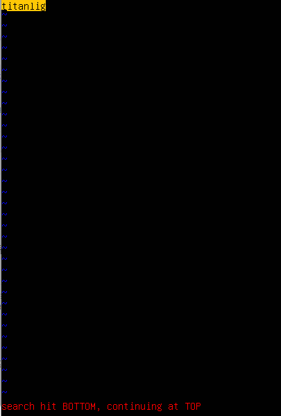

vim search

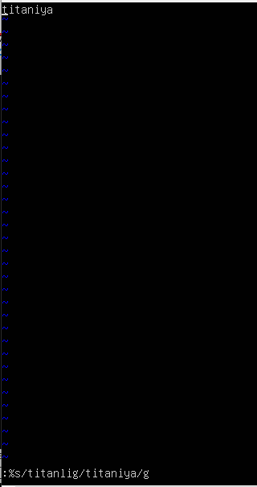

vim rewrite

- Установить текстовой редактор "nano".
      `sudo apt install nano`

- Cоздать файл *test_nano.txt*. Написать в нём свой никнейм, закрыть файл с сохранением изменений.
      `touch test_nano.txt`
      `nano test_nano.txt`

Выход с сохранением: `Ctrl+X` затем `Y`, затем `Enter`
Выход без сохранения: `Ctrl+X` затем `N`
Поиск: `Ctrl+W`
Замена: `Ctrl+\`

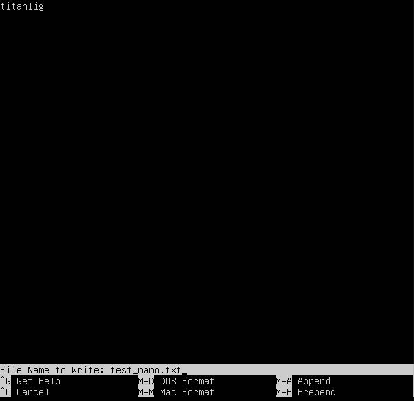

nano save

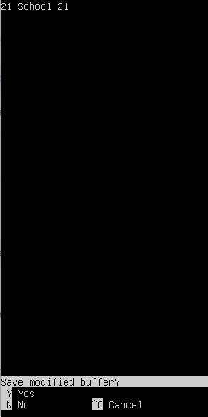

nano without save

nano search

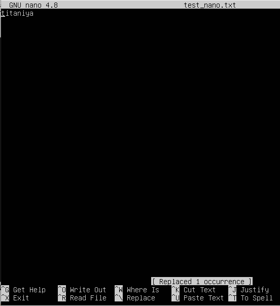

nano rewrite

- Установить текстовой редактор "emacs"
      `sudo apt install emacs`

- Cоздать файл *test_emacs.txt*. Написать в нём свой никнейм, закрыть файл с сохранением изменений.
      `touch test_emacs.txt`
      `emacs test_emacs.txt`

Выход с сохранением: `Ctrl + X`, `Ctrl + C`
Выход без сохранения: `Ctrl + X`, затем `Ctrl + C` - когда спросит о сохранении, `n`
Поиск: Откройте файл и введите какой-нибудь текст. `Ctrl + S` - начать поиск вперёд
Замена: `Alt + Shift + %` или `Alt + X`, введите `query-replace`

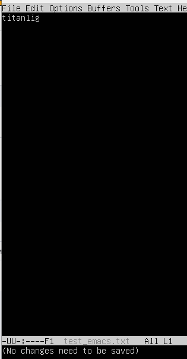

emacs save

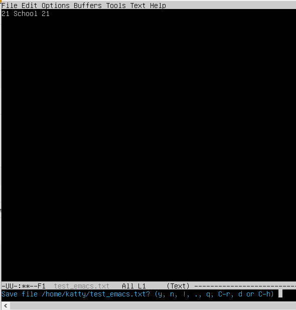

emacs without save

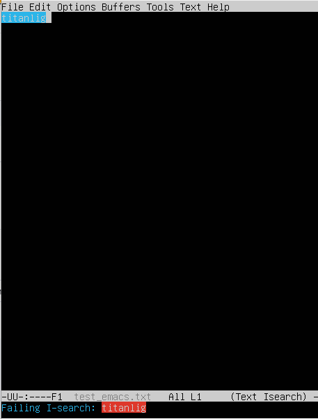

emacs search

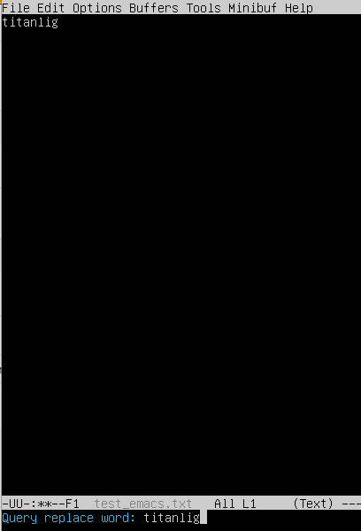

emacs rewrite1

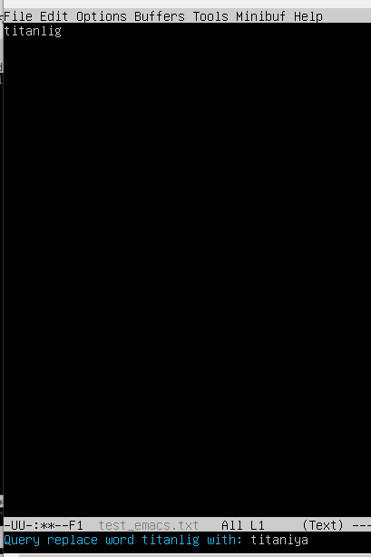

emacs rewrite2

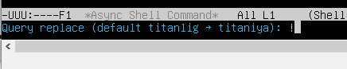

emacs rewrite3

## Часть 8. Установка и базовая настройка сервиса **SSHD**

- Установка SSH:
  - `sudo apt install openssh-server -y` (параметр `-y` означает автоматическое подтверждение (ответ "yes" на все вопросы))
- Автозагрузка:
  - `sudo systemctl enable ssh`
-  Смена порта (2022)
  - `sudo nano /etc/ssh/sshd_config`
>Изменить: Port 22 → Port 2022
  - `sudo systemctl restart ssh`

Используя команду ps, покажи наличие процесса sshd. Для этого к команде нужно подобрать ключи.
В отчёте объясни значение команды и каждого ключа в ней.

  - `ps aux | grep sshd`

`ps` (process status) — утилита для отображения информации о процессах.

Ключи:
`a` — показывает процессы всех пользователей (а не только текущего)

`u` — показывает процессы в пользовательско-ориентированном формате (с именем пользователя, использованием CPU, памяти и др.)

`x` — включает процессы без управляющего терминала (демоны, фоновые процессы)

`|` (pipe)
Символ перенаправления (конвейер). Перенаправляет вывод команды ps aux на вход команде grep. Позволяет объединять команды для фильтрации

`grep` (global regular expression print) — утилита поиска по тексту.

`sshd` — шаблон поиска (имя процесса SSH-демона). Ищет строки, содержащие "sshd" в выводе команды ps aux

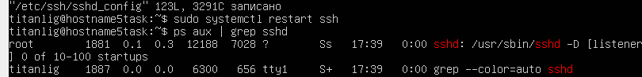

Рестарт ssh

  - `ps aux | grep [s]shd` grep не найдет себя

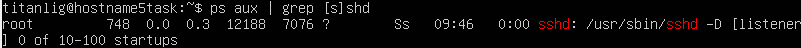

наличие только процесса sshd

Aктивные сетевые соединения в числовом формате 
  - `sudo netstat -tan`

`netstat` (network statistics) — утилита для отображения сетевой статистики

`-t` — показывать только TCP-соединения

TCP (Transmission Control Protocol) —  протокол с установкой соединения и гарантированной доставкой данных.
Игнорирует UDP (это протокол без установки соединения, "отправил и забыл"), ICMP ( служебный протокол для диагностики и сообщения об ошибках в сети) и другие протоколы

`-a` — показать все соединения (all)

Активные соединения

Ожидающие соединения (LISTEN)

Без этого ключа показываются только установленные соединения

`-n` — показывать адреса и порты в числовом формате (numeric)

Не преобразовывает IP-адреса в имена хостов

Не преобразовывает номера портов в имена служб

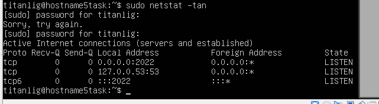

Вывод команды netstat -tan

## Часть 9. Установка и использование утилит **top**, **htop**

`top` — классический монитор процессов

Основные клавиши в top:

`P` — сортировка по использованию CPU (по умолчанию)

`M` — сортировка по использованию памяти

`N` — сортировка по PID

`k` — завершить процесс (kill)

`r` — изменить приоритет (renice)

`1` — показать загрузку по ядрам CPU

`h` — помощь

`q` — выход

Uptime
14 минут (up 14 min)

Количество авторизованных пользователей
  - 1 пользователь (1 user)

Средняя загрузка системы(load average)
  - 0,02 (за 1 мин), 0,14 (за 5 мин), 0,15 (за 15 мин)
(формат: 0,02, 0,14, 0,15)

Общее количество процессов
  - 115 процессов (Tasks: 115 total)

Загрузка CPU
  - 0,1% user, 0,2% system, 0,0% nice, 99,6% idle, 0,0% wait, 0,0% hardware interrupts, 0,1% software interrupts, 0,0% stolen time
(Общая загрузка ≈ 0,4% активного использования)

Загрузка памяти
  - Всего памяти: 1971,1 MiB
  - Свободно: 1067,9 MiB
  - Используется: 166,9 MiB
  - Buffer/Cache: 736,3 MiB
  - Swap свободен полностью
(Прямое использование памяти для процессов ≈ 8,5%)

PID процесса (Process ID), занимающего больше всего памяти
  - Больше всего памяти использует процесс:
PID 589 (multipathd) — 0,9% от общей памяти

PID процесса, занимающего больше всего процессорного времени
  - Больше всего CPU использует процесс:
PID 1755 (top) — 1,3%

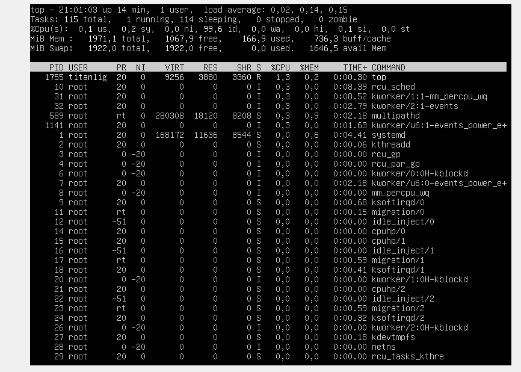

Вывод команды top

`htop`  — улучшенный монитор процессов

Основные клавиши в htop:

`F1` или `h` — помощь

`F2` — настройка (Setup)

`F3` или `/` — поиск

`F4` или `\` — фильтр

`F5` — дерево процессов

`F6` — сортировка (можно выбрать колонку)

`F7` и `F8` — уменьшить/увеличить приоритет (nice)

`F9` — завершить процесс (больше опций чем в top)

`F10` или `q` — выход

`Space` — отметить процесс для групповых операций

`U` — показать процессы только выбранного пользователя

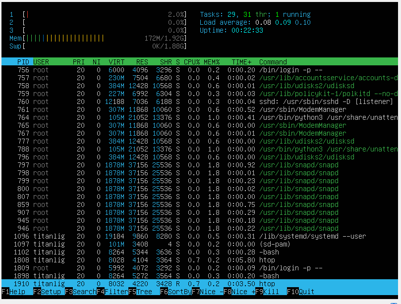

Сортировка по PID

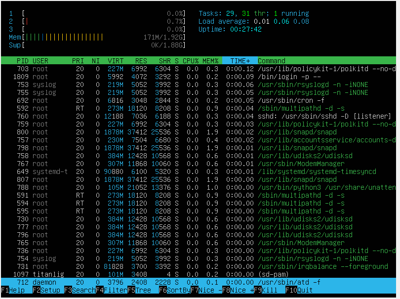

Сортировка по TIME

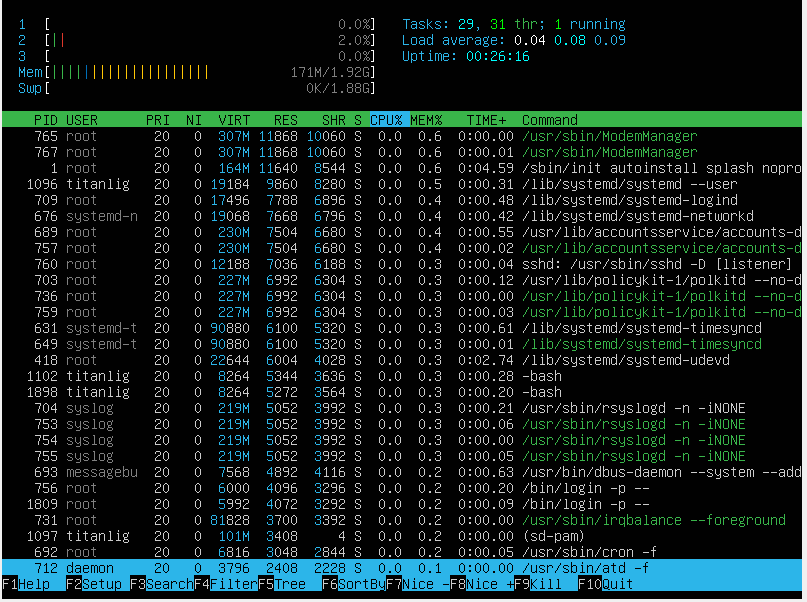

Сортировка по PERCENT_CPU

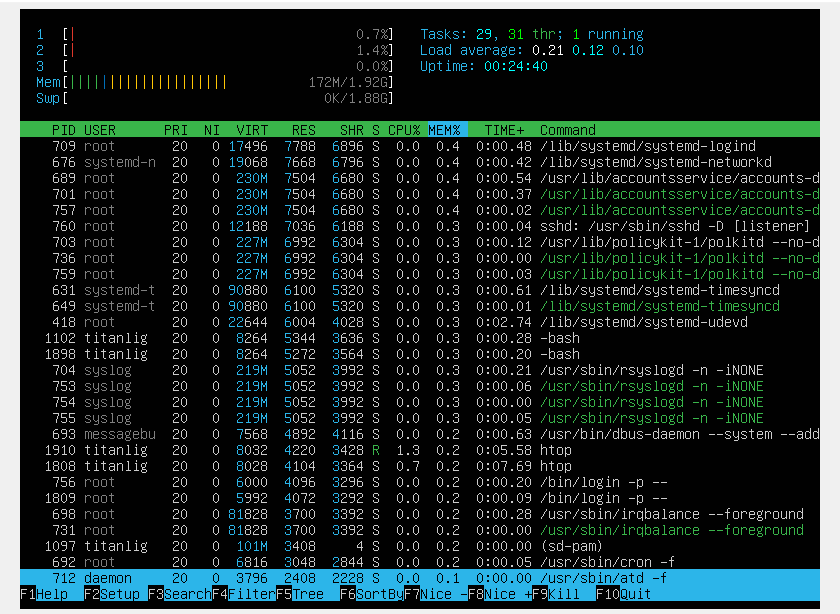

Сортировка по PERCENT_MEM

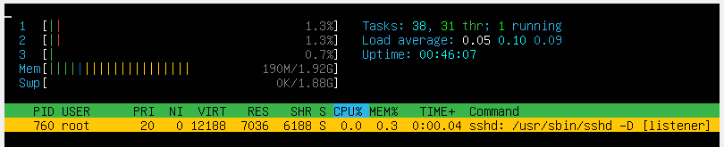

Отфильтрованно для процесса sshd

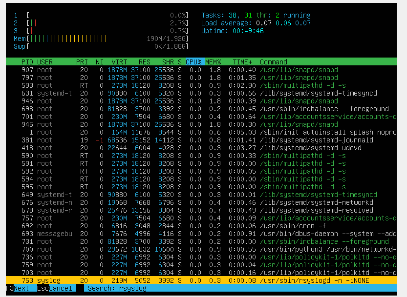

Процесс syslog

- Добавьте hostname, clock и uptime:
  -  Нажмите `F2` (Setup)
  -  Выберите "Meters" в левом меню

  - В "Available meters" выберите:
     - Hostname
     - Clock
     - Uptime

  - Нажмите `F5` чтобы добавить их в левую колонку

  - Нажмите `F10` для выхода из настроек

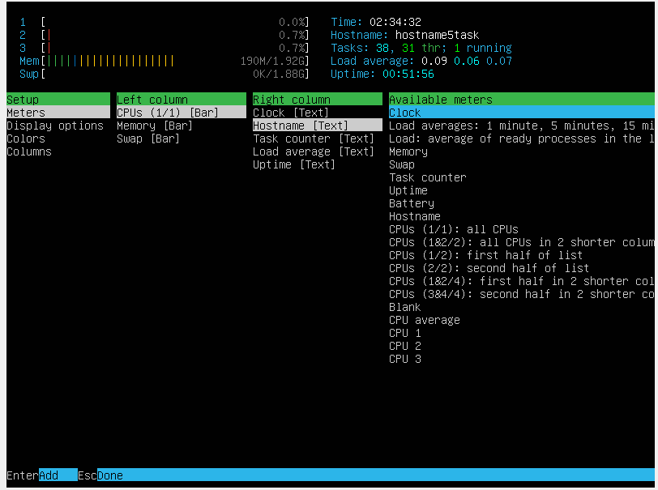

Добавленный вывод hostname, clock и uptime

## Часть 10. Использование утилиты **fdisk**

Запуск команды `fdisk -l`

Название жёсткого диска:
  - VGDX HARDOISK (модель, указанная для /dev/sda)

Размер жёсткого диска:
  - 23.64 GB (22,2 GiB, точнее 23 640 358 912 байт)

Количество секторов жёсткого диска:
  - 46 172 576 секторов

Размер swap:
  - 1,9 GB

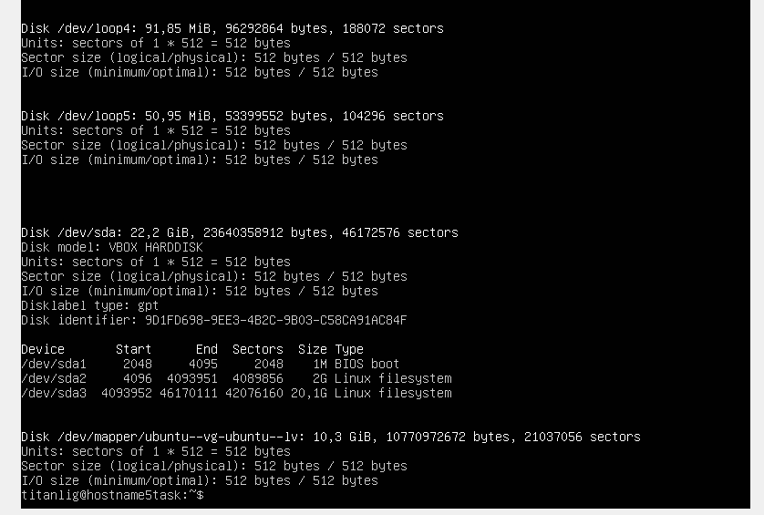

>Swap (подкачка, своп) — это специальное пространство на жестком диске, которое используется операционной системой как дополнительная "виртуальная" память, когда физической оперативной памяти (RAM) не хватает.

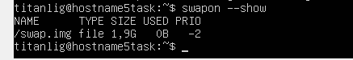

swapon show

## Часть 11. Использование утилиты **df** 

Команда `df` (disk free, без параметров)

Команда `df -Th`

Ключи:

`-T` — показать Type (тип файловой системы)

`-h` — human-readable (человеко-читаемый формат)

`df` Корневой раздел: /dev/mapper/ubuntu--vg-ubuntu--lv

Размер: 
  - ≈ 10,25 GB

Занято: 
  - ≈ 5,11 GB

Свободно: 
  - ≈ 4,60 GB

Использование: 
  - 53%

Единица измерения в выводе: 
  - Килобайты

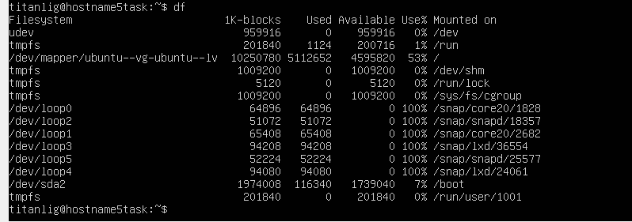

Вывод df

`df -Th`

Корневой раздел: /dev/mapper/ubuntu--vg-ubuntu--lv

Тип ФС: 
  - ext4

Размер: 
  - 9,8 GB

Занято: 
  - 4,9 GB

Свободно: 
  - 4,4 GB

Использование: 
  - 53%

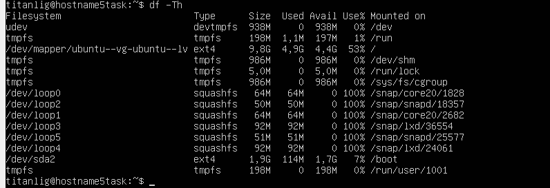

Вывод df -Th

## Часть 12. Использование утилиты **du**

`du` (disk usage)

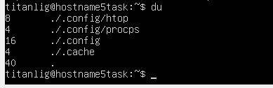

Запуск du

`du --bytes` отображение в читаемом виде

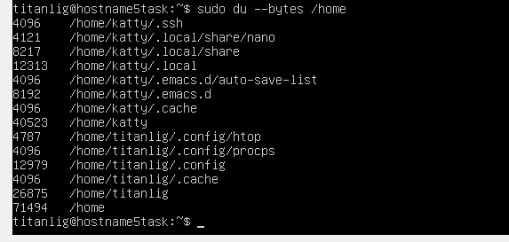

du /home

/var ≈ 62,7 MB

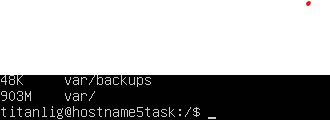

du /var

/var/log ≈ 62,7 MB

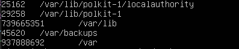

du var/log

Размер каждого элемента внутри /var/log (в байтах) через `sudo du -b /var/log/*`

  - /var/log/alternatives.log	35 288
  - /var/log/apt	113 714
  - /var/log/auth.log	23 041
  - /var/log/boot.log	50 870
  - /var/log/bootstrap.log	104 003
  - /var/log/btmp	3 155
  - /var/log/cloud-init.log	319 270
  - /var/log/cloud-init-output.log	17 704
  - /var/log/dist-upgrade	4 096
  - /var/log/dmesg	49 752
  - /var/log/dmesg.0	49 317
  - /var/log/dmesg.1.gz	15 043
  - /var/log/dmesg.2.gz	14 906
  - /var/log/dmesg.3.gz	15 435
  - /var/log/dpkg.log	576 554
  - /var/log/faillog	32 064
  - /var/log/fontconfig.log	2 505
  - /var/log/installer	1 020 345
  - /var/log/journal	58 728 448
  - /var/log/kern.log	311 052
  - /var/log/landscape	4 096
  - /var/log/lastlog	292 584
  - /var/log/private	4 096
  - /var/log/syslog	583 496
  - /var/log/ubuntu-advantage.log	3 817
  - /var/log/ubuntu-advantage-timer.log	460
  - /var/log/unattended-upgrades	156 379
  - /var/log/utmp	15 744

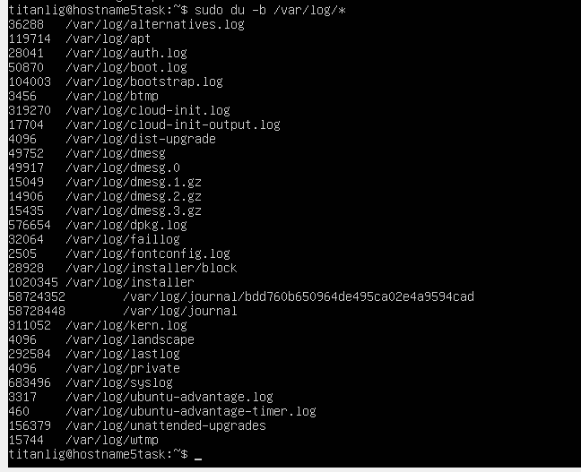

du all log

## Часть 13. Установка и использование утилиты **ncdu**

>`ncdu` (NCurses Disk Usage) — это интерактивная TUI-версия du с текстовым интерфейсом на базе ncurses.

Основное отличие: `du` выводит статичный текст, `ncdu` предоставляет интерактивный интерфейс для навигации.

Основное отличие: `du` выводит статичный текст, `ncdu` предоставляет интерактивный интерфейс для навигации.

1. Размер папки /home:
  - titanlig 40 KiB
  - katty 60 KiB
  - Всего 100 KiB

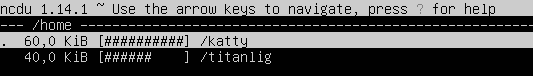

ncdu /home

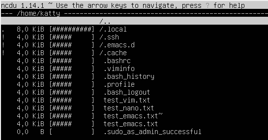

ncdu /home/katty

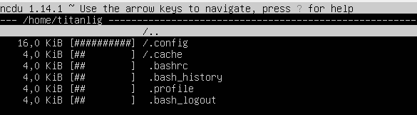

ncdu /home/titanlig

2. Размер папки /var:
  - Всего 900.9 MiB

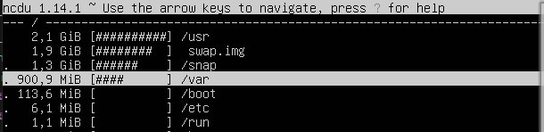

ncdu /var

3. Размер папки /var/log:
  - Всего 59,6 MiB

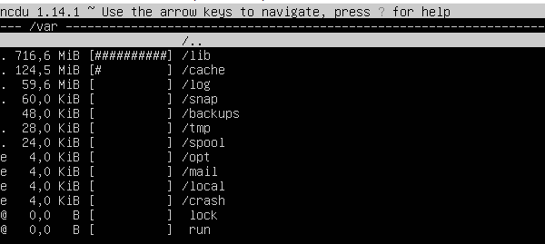

ncdu /var/log

## Часть 14. Работа с системными журналами

Открой для просмотра:
1. /var/log/dmesg
2. /var/log/syslog
3. /var/log/auth.log

  - `sudo cat /var/log/auth.log` (не будем использовать, файл может содержать тысячи строк)
  - `sudo tail /var/log/auth.log` (выведет только последние 10 строк)
  - `sudo tail -100 /var/log/auth.log` (выведет последние 100 строк)

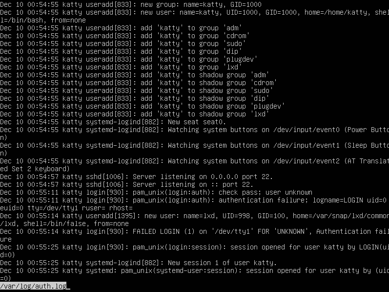

auth.log

>dmesg (display message или driver message). Утилита для вывода сообщений ядра (kernel ring buffer). Показывает события с момента последней загрузки системы.

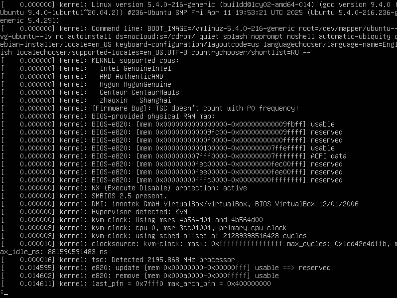

dmesg

lastlog

Время: Dec 11 02:27:49
Пользователь: titanlig
Метод: ssh

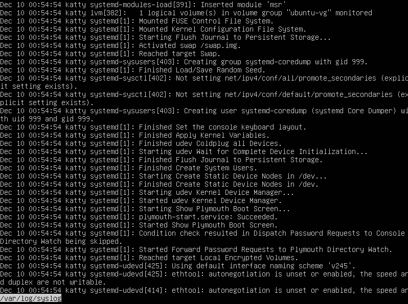

- Вставь в отчёт скрин с сообщением о рестарте службы

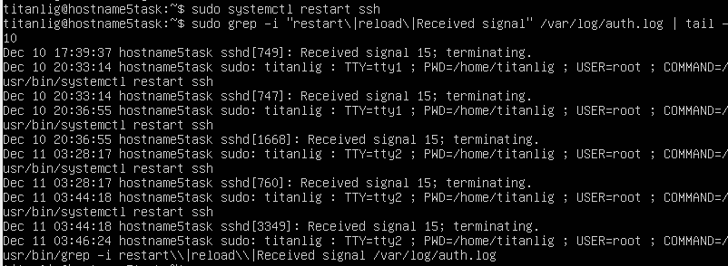

Рестарт ssh

## 15 Использование планировщика заданий CRON

- Используя планировщик заданий, запусти команду uptime через каждые 2 минуты

В crontab добавлена строка:
text
`*/2 * * * * /usr/bin/uptime`

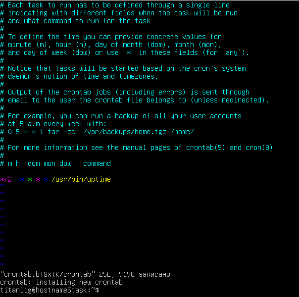
строка */2 * * * * /usr/bin/uptime в редакторе crontab

- Найди в системных журналах строчки (минимум две в заданном временном диапазоне) о выполнении

После добавления задания, чтобы его проверить, выполняется:

  - `crontab -l`

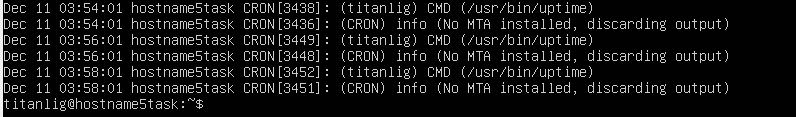
записи из /var/log/syslog с временными метками

- Удали все задания из планировщика заданий 

Удаление заданий командой:

  - `crontab -r`

вывод crontab -l показывает:

`no crontab for titanlig`

Отсутствие crontab после удаления